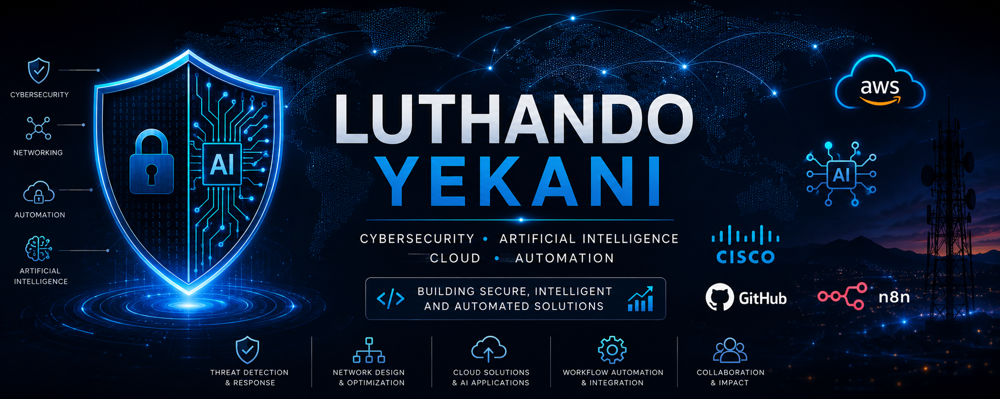

  

**👋 Welcome to My GitHub**

## Luthando Yekani

### Cybersecurity • Artificial Intelligence • Cloud • Automation

I am an aspiring Cybersecurity professional with a strong interest in AI-powered security, cloud technologies, networking, and automation.

My goal is to build practical solutions that combine cybersecurity best practices with artificial intelligence to solve real-world problems.

---

## 📌 Portfolio Highlights

- 🛡️ AI-Powered Cybersecurity Solutions
- 🤖 Intelligent Workflow Automation
- ☁️ AWS Cloud & Generative AI
- 🌐 Enterprise Networking
- 📜 Professional Certifications
- 📚 Continuous Learning

---

# 🚀 Featured Projects

## 🛡️ CyberGuardian AI Pro

AI-powered phishing analysis and cybersecurity awareness platform built with AWS PartyRock.

**Highlights**

- AI-powered phishing detection
- Threat analysis
- Risk scoring
- Personalized security awareness training

---

## 🤖 AI SOC Analyst

Evidence-based Security Operations Centre (SOC) assistant built with n8n and Google Gemini.

**Highlights**

- AI incident analysis
- MITRE ATT&CK mapping
- Executive reports
- Automated workflows

---

## 🎫 AI Support Ticket Assistant

AI-powered IT support automation workflow.

**Highlights**

- Ticket categorisation
- AI-generated responses
- Workflow automation
- Knowledge base integration

---

## 🌐 Enterprise Full Mesh Network

Cisco Packet Tracer enterprise networking project.

**Highlights**

- Four-router full mesh
- Static routing
- Network security
- Enterprise LAN design

---

## ☁️ AWS PartyRock Projects

A collection of AI applications and case studies built using AWS PartyRock.

---

# 📜 Professional Certifications

- AWS AI Practitioner
- Fortinet Certified Fundamentals in Cybersecurity
- Fortinet Network Fundamentals
- Fortinet Threat Landscape
- Fortinet Technical Introduction to Cybersecurity
- Lean Six Sigma White Belt
- Lean Six Sigma Yellow Belt
- UCT Construction Project Management

---

# 💻 Technical Skills

## Cybersecurity

- Threat Analysis
- Security Awareness
- SOC Fundamentals
- Network Security
- Risk Assessment

## Networking

- Cisco Networking
- Packet Tracer
- Routing & Switching
- VLANs
- Static Routing

## Artificial Intelligence

- Prompt Engineering
- Generative AI
- AI Automation
- AWS PartyRock
- Google Gemini

## Cloud

- AWS
- Amazon Bedrock

## Automation

- n8n
- Workflow Automation

---

# 🛠 Technologies

- Python (Learning)
- Git
- GitHub
- Cisco Packet Tracer
- Kali Linux
- Wireshark
- Nmap
- AWS
- Google Gemini
- n8n

---

# 🌱 Currently Learning

- SOC Operations
- AWS Cloud Security
- Threat Hunting
- Incident Response
- AI Security
- Python for Cybersecurity

---

# 📫 Connect With Me

- LinkedIn: https://www.linkedin.com/in/luthando-yekani-104a3b382
- Email: yek.trading@gmail.com
- GitHub: https://github.com/LuthandoYekani

---

> *"Continuous learning, practical projects, and real-world problem solving."*
